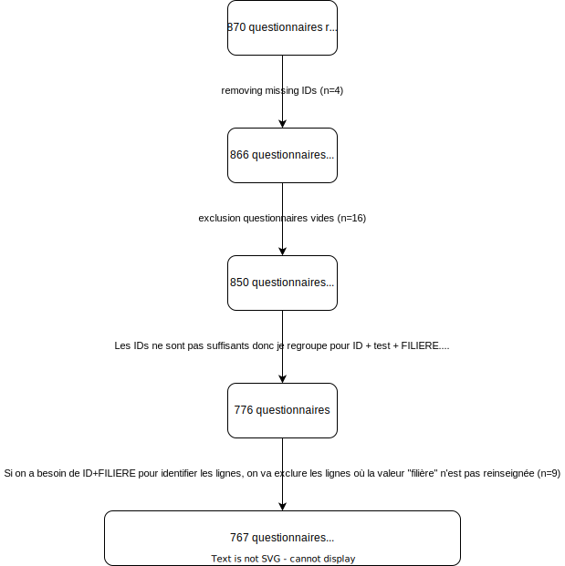

```{r chunk options, echo=F}
# Chunk options
knitr::opts_chunk$set(
  echo       = T,    # Should blocks with program code be shown in knitted documents?
  eval       = TRUE,    # Should program code be evaluated?
  fig.height = 6,       # Default height for plots.
  fig.width  = 10,       # Default width for plots.
  fig.align  = "center", # Default alignment for plots in knitted documents.
  warning = F,
  tidy = T
)

```

```{r libraries and data loading, include = F}

# LIBRARIES ----------------------------------------------------------------------------------
library(conflicted)    # Get a warning/error if several functions with the same name exist.
library(magrittr)      # Operator %>% and additional pipe-friendly functions.
library(tidyverse)     # The main "tidyverse" packages.
library(openxlsx)      # Write data to Excel files.
library(stringr)
library(psych)
library(knitr)
library(kableExtra)
library(pander)
library(DT)
library(janitor)
library(broom)
library(fmckage)

conflicted::conflicts_prefer(dplyr::filter)

# DATA ------------------------------------------------------------------------------------------
post = read.xlsx("Copie de resultats Q2 copie.xlsx", sheet = 1)
pre = read.xlsx("Copie de resultats Q1 copie.xlsx", sheet = 1)
```

```{r data_management, include = F}
# Colnames() to lowercase
colnames(pre) = tolower(colnames(pre))
colnames(post) = tolower(colnames(post))

# MERGING PRE E POST ----------------------------------------------------------
pre = pre %>% 
    select(-contains(c("id","submitdate","lastpage","startlanguage"))) %>% 
    rename("filiere"=b1, "id" = a1) %>% 
    mutate(test = "pre")

post = post %>%
    filter(!is.na(submitdate)) %>% 
    select(-contains(c("id","submitdate","lastpage","startlanguage","x26","x27"))) %>% 
    rename("id" = a1) %>% 
    left_join(pre[,c("id","filiere")], by = "id") %>% 
    relocate(filiere, .after = "id") %>% 
    mutate(test = "post")

# Merging
data = rbind(pre,post) %>% tibble

# DATA MANAGEMENT merged DF ----------------------------------------------------
data = data %>% 
    mutate(across(s1q1:s7q2, as.numeric)) %>% 
    distinct() %>% 
    relocate(test, .after = "id") %>%
    mutate(filiere = case_when(filiere == "étudiant(e) en maïeutique" ~ "maieutique",
                               filiere == "étudiant(e) en orthophonie" ~ "orthophonie",
                               filiere == "étudiant(e) en pharmacie" ~ "pharmacie",
                               filiere == "étudiant(e) IDE" ~ "IDE",
                               filiere == "étudiant(e) MKE" ~ "MKE",
                               filiere == "interne de médecine générale" ~ "medecine generale",
                               TRUE ~ NA_character_
                               )
           )

# Adding mean score column
data = data %>% mutate(score = round(rowMeans(across(s1q1:s7q2),na.rm=T),2))
```

# Exploratory analysis

## Selection des questionnaires

```{r filtering_out_invidalid_questionnaires, include = F}
rows_1 = nrow(data)
unique_ids_1 = n_distinct(data$id)

# Removing missing IDs rows (n=4)
data = data %>% filter(!is.na(id))
unique_ids_2 = n_distinct(data$id)
rows_2 = nrow(data)

# Computing missing values per row
data = data %>% filter(!is.na(id)) %>% 
    mutate(na_counts = rowSums(across(s1q1:s7q2, is.na)))

# Empty questionnaires
empty_q = sum(data$na_counts==20)


# Removing totally incomplete questionnaires
data = data %>% filter(na_counts<20)
unique_ids_3 = n_distinct(data$id)
rows_3 = nrow(data)

```

Au tout début on a **`r rows_1`** lignes et **`r unique_ids_1`** IDs. Après avoir exclu 4 lignes à cause de missing ID, on descend à **`r (rows_1 - 4)`** questionnaires et **`r unique_ids_2`** IDs (l'ID "valeur manquante" n'est plus comptabilisé, c'est pour ça qu'on "perd" un ID).

Sachant que **`r unique_ids_2`**x2=**`r (unique_ids_2*2)`** on a **`r rows_2 - 760`** entrées de trop. On retrouve **`r empty_q`** questionnaires completement vides, qu'on peut exclure ce qui nous donne **`r rows_3`** questionnaires et **`r unique_ids_3`** IDs uniques.

On est tjrs très loin de notre objectif de environ **`r (unique_ids_2*2)`** questionnaires (**`r (unique_ids_3*2)`** maintenant qu'on a **`r unique_ids_3`** IDs). Donc, on a forcement des IDs pour lesquels on a **\>2** entrées. Voyons de les mettre en evidence.

```{r IDs_with_too_many_entries}
data %>% 
    group_by(id) %>% 
    summarise(n=n()) %>%
    arrange(desc(n)) %>%
    datatable(options = list(pageLength = 10,
                             #dom = 't',
                             scrollX = TRUE,
                             width = "auto",
                             scrollX = T
                             ))

problematic_IDs = data %>% group_by(id) %>% summarise(n=n()) %>% filter(n>2) %>% nrow

```

Comme tu peux le voir on semble avoir `r problematic_IDs` IDs presents **au moins** 3 fois. Creusons plus loin pour voir si on identifie un groupe d'IDs problematique. Théoriquement, si les gens avaient respecté les régles pour la création de l'identifiant anonyme, l'identifiant devrait suivre le *pattern* suivant: 1 chiffre - 2 lettres - 2 chiffres.

Voyons pour combien de lignes ce *pattern* est respecté:

```{r "looking_for_IDs_not_following_the_rules"}
str_detect(data$id, "[:digit:]{1}[:alpha:]{2}[:digit:]{2}") %>% 
    table %>%
    pander
```

Cela nous dit que **même si** on regarde seulement les gens qui ont respecté la procedure pour la création des IDs, on à tjrs des lignes de trop. D'abord, regardons les entrés des gens qui ont tapé un ID au pif (donc les "falses").

```{r "dataframe_IDs_aberrants"}
data %>% 
    filter(!str_detect(id, "[:digit:]{1}[:alpha:]{2}[:digit:]{2}")) %>%
    arrange(id) %>% 
    datatable(options = list(pageLength = 10,
                             #dom = 't',
                             scrollX = TRUE,
                             width = "auto",
                             scrollX = T
                             ))
```

Néanmoins, s'ils ont utilisé 2 fois **le même** identifiant *aberrant* on pourra quand même les apparier. Voyons donc les IDs qui apparaissent **\>2** fois. Les IDs *aberrants* qui apparaissent **2** fois on peut les utiliser, les IDs qui apparaissent qu'une seule fois, idem, on peut les garder pour la partie descriptive (carrément ils ne sera pas possible de les utiliser pour la comparaison avant-après).

```{r "IDs_aberrants_presentes_2plus_fois"}
data %>% 
    filter(!str_detect(id, "[:digit:]{1}[:alpha:]{2}[:digit:]{2}")) %>%
    group_by(id) %>%
    summarise(n=n()) %>% 
    arrange(desc(n)) %>%
    datatable(options = list(pageLength = 10,
                             #dom = 't',
                             scrollX = TRUE,
                             width = "auto",
                             scrollX = T
                             ))
```

On voit que le seul ID problematique parmi les *aberrants* est **"12345"**. Voyons les lignes qui correspondent à cet ID.

```{r filtering_on_ID_12345}
data %>% 
    filter(id=="12345") %>%
    datatable(options = list(pageLength = 10,
                             #dom = 't',
                             scrollX = TRUE,
                             width = "auto",
                             scrollX = T
                             ))
```

On semble avoir 1 IDE et 1 MG, qui ont un doublon de "2ème test". Si on regarde avec attention la ligne 3 et 4 sont identiques, avec une "filière" différente. Si la ligne 3 et 4 étaient par exemple "IDE" et la ligne 5 et 6 étaient "medecine generale" on aurait identifié des doublons --\> problème résolu. Mais dans ce cas on a des doublons **ET** 2 personnes qui ont rentré 2 fois le "2ème test" en changeant aussi de filière. Ou Il est donc impossible de rattacher ces questionnaires à un "test 1". Ce qui est très très bizarre, est que les lignes 3 et 5 sont IDENTIQUES aux lignes 4 et 6. Ce qu'on peut faire, est prendre la moyenne des lignes 3-5 et 4-6. Le même approche nous sera utile pour gérer les IDs *non aberrants* doublons qui sont les suivants:

```{r IDs_non_aberrants_de_trop}
data %>% 
    filter(str_detect(id, "[:digit:]{1}[:alpha:]{2}[:digit:]{2}")) %>%
    group_by(id) %>%
    mutate(n=n()) %>% 
   filter(n>2) %>%
    relocate(n, .after = id) %>% 
    arrange(desc(n)) %>% 
    datatable(options = list(pageLength = 10,
                             #dom = 't',
                             scrollX = TRUE,
                             width = "auto",
                             scrollX = T
                             ))

data = data%>%
     group_by(id, test, filiere) %>%
     summarise(across(s1q1:last_col(), ~mean(., na.rm = TRUE)), .groups = "drop")
```

Vu que "ID" ne suffit pour identifier uniquement les lignes, si on prend "ID" + "test" + "filiere" et on fait la moyenne des lignes ambigues on devrait s'en sortir pas mal. Cela nous laisse avec `r nrow(data)` questionnaires.

Bon, on sait dejà qu'on a des IDs qui apparaissent trop souvent mais si on prend ID-filiere, est-ce que maintenant on a max 2 lignes par couple ID-filiere?

```{r uniques_ID_FILIERE}
df = data %>% 
    group_by(id,filiere) %>%
    summarise(n=n()) %>% 
    arrange(desc(n)) 

df %>%
    datatable(options = list(pageLength = 10,
                             #dom = 't',
                             scrollX = TRUE,
                             width = "auto",
                             scrollX = T
                             ))

```

Oui! Nous avons maintenant `r nrow(df)` identités uniques données par ID+FILIERE. Vu qu'on a besoin de "filière" pour identifier les gens, on va exclure les lignes où "filière" n'est pas renseigné.

```{r dropping_filiere_na}
filiere_na = data %>% filter(is.na(filiere)) %>% nrow()

# REMOVING MISSING "filiere" rows
data = data %>% filter(!is.na(filiere))

# How many questionnaires left?
questionnaires = nrow(data)
# How many unique identifties?
ids = data %>% distinct(id,filiere) %>% nrow

```

On exclu donc `r filiere_na` lignes car filière non renseignée On est maintenant à **`r questionnaires`** questionnaires pour **`r ids`** identités. Voyons de récapituler comment on fait le trie sur les questionnaires.

```{r flowchart, echo=FALSE, fig.cap=caption, out.width=800, out.height=800}
# Caption/Description.
caption <- "Flowchart inclusion questionnaires"

# Path or URL to the figure.

```

Du coup, les critères d'exclusion ont été les suivants:

-   ID manquant

-   filière manquante

-   questionnaires vides

Si on a toujours plusieurs lignes pour une triplette ID-TEST-FILIERE, on fait la moyenne des scores (carrément les "test 1" avec les "test 1" et les "test 2" avec les "test 2")

## Population - Nb et distribution par filière

```{r sujets_distribution_par_filiere}

data %>% distinct(id,filiere) %$% 
    table(filiere) %>% 
    as.data.frame() %>% 
    mutate("%" = round(Freq/sum(Freq)*100, 2)) %>% 
    rename("Nb sujet participants" = Freq) %>% 
    adorn_totals() %>% 
    pander(caption = "**Repartition sujets par filière**")
```

## Missing values

Voyons sur tout l'ensemble de tests, combien de données manquantes on a. Ce sont des "vraies" données manquantes **OU** des "NSP" qui n'était pas pertinents pour la question et vraisemblablement pris pour des *"Ne sait pas".*

```{r exploring_missing_values_frequencies}
table(data$na_counts) %>% 
    as.data.frame() %>% 
    mutate("%" = round(as.numeric(Freq/sum(Freq)*100), 2),
           Var1 = round(as.numeric(as.character(Var1)),2)) %>% 
    rename("Nb missing values" = Var1) %>% 
    pander(caption = "**Nb de valeurs manquantes par questionnaire**")

```

On voit que les tests sont bien complets globalement. Seulement 10 questionnaires ont **\>=3** valeurs manquantes. Les **"0.33"** et **"0.5"** valeurs manquantes sont le resultat d'avoir fait la moyenne sur plusieurs lignes lorsque on avait plusieurs lignes pour ID-test-filiere. Par exemple, le sujet avec **"0.33"** valeurs manquantes, probablement avait 3 lignes, avec 1 valeur manquante sur les 3 lignes donc "0.33" valeurs manquantes en moyenne.

Pour refaire un peu le point voici un tableau très intéressant. On obsèrve que la distribution des sujets par filière et la distribution des *tests appariés* par filière est pratiquement identique, donc les tests appariés gardent la représentativité de la population générale.

```{r summarise_by_filiere}
# Creating table paired_questionnaires
tab_paired_questionnaires <- data %>%
  group_by(id, filiere) %>%
  summarise(n = n(), .groups = "drop") %>%
  arrange(desc(n)) %$%
  table(filiere, n) %>%
  data.frame() %>%
  pivot_wider(names_from = n, values_from = Freq) %>%
  setNames(c("Filiere", "Tests non apparies", "Tests apparies"))


data %>%
  group_by(filiere) %>%
  summarise(id = n_distinct(id),nb_questionnaires = n(), 
            valeurs_manquantes = as.integer(sum(na_counts))
  ) %>%
  left_join(tab_paired_questionnaires, by = c("filiere" = "Filiere")) %>% 
  mutate(across(c(id:`Tests apparies`),
                ~paste0(.x, " (", round(.*100/sum(.),2), "%)", 
                        sep = ""))
      ) %>% 
  select(-ends_with("%")) %>% 
  datatable(options = list(
    pageLength = 10,
    scrollX = TRUE,
    width = "auto",
    scrollX = TRUE
  ))

```

# Statistiques

## Descriptives{.tabset}

```{r t-test_tous_confondus}
# DF with id-filiere-pre-post pour les tests stat
paired_data <- data %>%
  group_by(id, filiere, test) %>%
  summarise(mean_score = mean(c_across(s1q1:s7q2), na.rm = T), .groups = "drop") %>%
  pivot_wider(names_from = "test", values_from = "mean_score") %>%
    filter(!is.na(post),!is.na(pre)) %>% distinct

```

### Mesures de dispersion - ensemble des tests (appariés ET non)

```{r dispersion_measures_all_tests}
    # describe tables
rbind(describe(data$score, fast = T),
      describe(data$score[data$test=="pre"], fast = T),
      describe(data$score[data$test=="post"], fast = T)) %>% 
    as.data.frame(row.names = c("Ensemble", "pre", "post")) %>%
    rename(deviation_standard = sd, ecart_type = se) %>% 
    kable(caption = "Tous tests confondus - Mesures de dispersion")%>%
    kable_styling(full_width = T)

    # idem by filière
data %>% group_by(filiere) %>% summarise(describe(score,fast=T)) %>% 
    as.data.frame(row.names = c("Ensemble", "pre", "post")) %>%
    rename(deviation_standard = sd, ecart_type = se) %>% 
    kable(caption = "Tous tests confondus - Mesures de dispersion by filière")%>%
    kable_styling(full_width = T)


```

### Mesures de dispersion - tests appariés

```{r dispersion_measures_paired_tests}
# paired tests -------------------------------------
    # describe tables
paired_data %>%
  pivot_longer(
    cols = c("pre", "post"),
    names_to = "time",
    values_to = "value"
  ) %>%
  summarise(
    filiere = "Overall",
    time = "Overall",
    mean = mean(value, na.rm = TRUE),
    median = median(value, na.rm = TRUE),
    deviation_standard = sd(value, na.rm = TRUE),
    ecart_type = sd(value, na.rm = TRUE) / sqrt(sum(!is.na(value)))
    ) %>% 
    mutate(across(is.numeric,round,2)) %>% 
    kable(caption = "Tests appariés - mesures de dispersion") %>%
    kable_styling(full_width = T)

    # idem by filière
paired_data %>%
    pivot_longer(cols = c("pre", "post"),
                 names_to = "time",
                 values_to = "value") %>% group_by(filiere, time) %>%
    summarise(mean = mean(value, na.rm = TRUE),
              median = median(value, na.rm = TRUE),
              deviation_standard = sd(value, na.rm = TRUE),
              ecart_type = sd(value, na.rm = TRUE) / sqrt(sum(!is.na(value)))) %>%
    mutate(across(is.numeric,round,2)) %>% 
    kable(caption = "Tests appariés - mesures de dispersion by filière") %>%
    kable_styling(full_width = T)


```

### Test de Wilcoxon sur données appariées

Pour realiser un test de student, une parmi les plusieurs conditions de validité est que la variable qu'on étudie doit suivre la *loi normale*: sa distribution a une forme en cloche simmetrique. Or, on voit que dans notre cas, ce n'est pas du tout le cas. Cela nous rend "impossible" ("" parce que en vrai je peux quand meme le lancer sans soucis le test et très probablement personne te demanderait si tu as verifié les conditions de validité du test) utiliser le *t student* et on va devoir "se contenter" d'un test *non-parametrique* (quand la variable étudie ne suit pas une distribution précise, comme la loi normale par example).

```{r distribution_scores_by_filiere, fig.height=10}
paired_data %>%
  pivot_longer(cols = c("post", "pre"), names_to = "test", values_to = "score") %>%
  mutate(score = round(score, 2)) %>%
  mutate(score = factor(score, levels = rev(sort(unique(score))))) %>%
  mutate(score = cut(as.numeric(as.character(score)), breaks = 20)) %>%
  ggplot(aes(x = score)) +
  geom_bar(aes(fill = test), alpha = 0.3, position = "identity") +
  scale_y_continuous(breaks = seq(0, 1000, 10)) +
  coord_flip() +
  labs(title = "Mean questionnaire score distribution") +
  facet_wrap(vars(filiere), ncol = 2)
```

L'equivalent non parametrique du *t student apparié* est le test de rang signé de wilcoxon avec correction de continuité. Je me repète, le test du rang signé de Wilcoxon est un test statistique non paramétrique qui compare deux échantillons apparentés ou des mesures répétées sur un seul échantillon afin d'évaluer si les rangs moyens de leur population diffèrent (c'est-à-dire qu'il s'agit d'un test de différence par paires). Il peut être utilisé comme alternative au test t de Student lorsque la population ne peut pas être supposée normalement distribuée.

En statistique, le "rang" fait référence à la position d'une valeur particulière au sein d'un ensemble de données lorsqu'elles sont classées par ordre croissant ou décroissant.

Par exemple, considérons l'ensemble de données suivant : {3, 7, 1, 4, 6}. Si nous le classons par ordre croissant, nous obtenons {1, 3, 4, 6, 7}. Le "rang" de chaque nombre dans l'ensemble de données original est alors sa position dans l'ensemble de données ordonné. Ainsi, le rang de 3 est 2, le rang de 7 est 5, le rang de 1 est 1, le rang de 4 est 3 et le rang de 6 est 4.

Dans le cadre du test du rang signé de Wilcoxon, les différences entre des observations appariées sont classées en fonction de leur valeur absolue. Le signe de la différence est ensuite appliqué au rang. Cela permet au test de prendre en compte à la fois l'ampleur des différences (par le biais des rangs des différences absolues) et le sens des différences (par le biais des signes).

Pense à l'ECN: on veut comparer la performance des éléves de 2 lycées. Le test de wilcoxon pourrait nous aider à répondre à la question "est-ce que si le classement (rang) median des élèves d'un lycée X ou Y est meilleure que le classement (rang) median de l'autre.

Je vais lancer le test sur l'ensemble de la population et t'expliquer le résultat.

```{r}
wilcox.test(paired_data$post,
                        paired_data$pre, paired = T
                       )
```

-   **"Test de rang signé de Wilcoxon avec correction de continuité"** : Ceci indique le test spécifique utilisé. La partie "correction de continuité" est une technique permettant d'ajuster le test de rang signé de Wilcoxon pour tenir compte du fait que nous utilisons une version discrète d'une distribution continue.

-   **"Données : paired_data\$post et paired_data\$pre"** : Ceci spécifie les deux ensembles de mesures ou d'observations qui ont été comparés dans le test.

-   **"V = 52171"**: Il s'agit de la statistique du test. Pour le test du rang signé de Wilcoxon, il s'agit de la somme des rangs des différences positives (ou de la somme des rangs négatifs, selon le logiciel utilisé).

-   **"p-value \< 2.2e-16"** : Il s'agit de la valeur p du test, qui est utilisée pour interpréter les résultats. Si la valeur p est inférieure au seuil de signification choisi (souvent 0,05), l'hypothèse nulle est rejetée. Dans ce cas, la valeur p est extrêmement faible, et il y a donc de bonnes raisons de rejeter l'hypothèse nulle.

-   **"Hypothèse alternative : le véritable distance entre les 2 medianes n'est pas égal à 0"** : Il s'agit de l'hypothèse alternative du test. Pour le test du rang signé de Wilcoxon, l'hypothèse nulle est que la médiane des différences entre les paires d'observations est égale à zéro. Cette hypothèse alternative indique que la véritable médiane des différences n'est pas nulle.

En termes simples, le test indique qu'il existe une différence statistiquement significative entre les mesures avant et après dans ces données appariées, avec une valeur p très faible (\<0.001) fournissant une preuve solide contre l'hypothèse nulle.

Je vais faire la même chose pour chaque filière prise singulièrement.

```{r t.test_by_filiere, fig.height=10}
# initialising emtpty list
results <- list()

#Iteration over filiere
 # for (index in unique(data$filiere)) {
 #   test <- t.test(paired_data$post[paired_data$filiere == index],
 #     paired_data$pre[paired_data$filiere == index],
 #     paired = TRUE, var.equal = F
 #   )
 # 
 #   results[[index]] <- test
 # }

 for (index in unique(data$filiere)) {
   test <- wilcox.test(paired_data$post[paired_data$filiere == index],
     paired_data$pre[paired_data$filiere == index],
     paired = T
   )

   results[[index]] <- test
 }


 # Formatting results
 result_df <- lapply(results, function(test) {
   data.frame(
       # mean_score_difference = test$estimate,
       p.value = pval_format(test$p.value),
       #conf = test$conf.int,
       #low_high_tag = rep(c("conf.low","conf.high")),
       method = test$method
       )
     }
   )

 # Merge the data frames in the list
 merged_df <- bind_rows(result_df, .id = "filiere")

 merged_df %>% pander()
 
 # Print the merged data frame
 # merged_df %>%
 #   pivot_wider(values_from = conf, names_from = low_high_tag) %>%
 #   mutate(across(where(is.numeric), round, 3)) %>%
 #   left_join(tab_paired_questionnaires[c("Filiere", "Tests apparies")],
 #             by = c("filiere" = "Filiere")
 #   ) %>%
 #     arrange(filiere) %>%
 #     rename(n = "Tests apparies") %>%
 #     relocate(n, .after = "filiere") %>%
 #     relocate(method, .after = last_col()) %>%
 #     relocate(p.value, .after = last_col()) %>%
 #     mutate(n = paste(n, "/",
 #                    tab_paired_questionnaires$`Tests non apparies` +
 #                                         tab_paired_questionnaires$`Tests apparies`,
 #                    sep = "")) %>%
 # 
 #     datatable(options = list(pageLength = 10,
 #                              #dom = 't',
 #                              scrollX = TRUE,
 #                              width = "auto",
 #                              scrollX = T
 #                              ))

```
